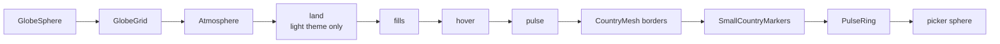

# Globe Rendering

How the 3D globe is drawn: a stack of concentric spheres in a React Three Fiber scene, with country fills painted on canvas textures.

## Why

The globe is the whole playfield, so it has to stay smooth on phones while showing up to ~250 country states at once.
Repainting a 4096×2048 canvas (32 MB) on every hover or claim would drop frames, so each layer only repaints when its own state changes, and only the region that changed.

## How it works

`GlobeDynamic.tsx` imports `Globe.tsx` with `ssr: false`, because Three.js needs the browser.
`Globe.tsx` lays out the scene; behavior lives in hooks under `components/globe/hooks/`.

Layer stack, inside out.
Every layer is a sphere at the origin, so draw order comes from `GLOBE_LAYER` (`renderOrder`), not depth:

- **Land** (`useCountryTextures`): paints the in-play countries as land, so in continent modes the rest of the world reads as ocean.
  Only exists when the palette has a `land` color (light theme).
- **Fills** (base layer, mipmapped): resolved and wrong-guess fills.
  It repaints in place: only countries whose fill changed are redrawn, by clearing their padded bounds and redrawing every overlapping fill, clipped, in full-repaint order.
  Past `MAX_REGION_REPAINTS` changes (for example a theme switch) it does a full repaint instead.
- **Hover**: only the hovered country, on a canvas cropped to its bounds and mapped back with texture `repeat`/`offset`.
  A hover costs a crop-sized upload, never the full planet.
  While nothing is hovered, a 1×1 transparent texture stands in so the material never recompiles.
- **Pulse**: the target country painted once in white.
  `PulseFillLayer` flashes it red/white with a per-frame material tint on the `PULSE_CONFIG` beat, so no canvas is ever repainted.
- **Borders**: `CountryMesh` line segments (`three-geojson-geometry`), rebuilt only when the emphasis set changes.
- **Markers**: `SmallCountryMarkers` draws spheres for `SMALL_COUNTRIES` and Point features (Tuvalu); their pulse runs imperatively in `useFrame`.
- **PulseRing**: GLSL radar rings at the target's centroid (the largest polygon's, so France pulses on the mainland), sharing the same beat.
- **Picker**: an invisible sphere that catches pointer events and hands them to `useCountryPicking`.

Each country's outline is projected once (d3 `geoPath`, equirectangular) into a cached `Path2D`, so repaints only refill shapes.

**What gets painted.**
`resolvedCountries` maps a country to a named `Resolution` (colored from the palette) or an explicit `CountryFill`.
Race mode builds explicit fills in `raceFills` (`lib/store/race-store.ts`): claims in the claimant's color, misses stippled with the `dots` pattern, and countries nobody reached in the palette's "failed" red.

**Emphasis.**
`emphasisIds` in `Globe.tsx` is the playfield (null when the whole world is in play).
Out-of-set borders and markers render at `outOfSetScale` (0.1 in dark, 0 in light).
On the menu it previews the set selected in settings.

**Picking.**
`useCountryPicking` builds an index once: small-country centroids first (closest within `smallCountryClickRadius`, scaled up on touch), then bounding-box-gated `geoContains`.
Clicks are ignored past a drag threshold and outside the active set.

**Floating labels.**
`LabelProjector` projects the game store's `floatingLabels` to screen space in `useFrame` and writes them to `label-projection-store`; `ClickFeedback` renders them in the DOM.

## Tech

- React Three Fiber, drei `OrbitControls`, Three.js `CanvasTexture`.
- d3-geo for projection, centroids, bounds and point-in-polygon.
- `three-geojson-geometry` for border lines.

## Key files

- `components/globe/Globe.tsx` - scene layout, emphasis, pointer handling, `PulseFillLayer`, `LabelProjector`
- `components/globe/hooks/useCountryTextures.ts` - land, fills, hover and pulse textures
- `components/globe/hooks/useCountryPicking.ts` - pointer to country lookup
- `components/globe/SmallCountryMarkers.tsx` - micro-state markers
- `components/globe/PulseRing.tsx` - radar shader
- `lib/hooks/useSceneColors.ts` - active `ScenePalette` for the current theme
- `lib/constants.ts` - `SCENE_PALETTES`, `GLOBE_LAYER`, `PULSE_CONFIG`, `GLOBE_CONFIG`, `SMALL_COUNTRIES`

## Decisions and gotchas

- Nothing paints or uploads textures per frame; keep it that way.
- Any new transparent layer needs a `GLOBE_LAYER` entry, or a layer that mounts later (like light-theme land) jumps in front until reload.
- Scene colors come from `useSceneColors()`, never a constant import, so a theme switch re-renders materials and fires repaints exactly once.
- The palette renders `unlit` and the canvas is `flat` (no tone mapping), so fills land at their exact palette value.
- No hover on touch: a finger drag is navigation, and the highlight would just flash under it.
- `Globe` accepts a `scene` override so race mode drives phase, set, emphasis and pulse instead of the solo store.

## Related

- [Camera and controls](camera-and-controls.md)
- [Country data](country-data.md)
- [Design system](design-system.md)
- [Race client](race-client.md)
- [Scene palette](design-scene-palette.md)
- [Player colors](player-colors.md)
