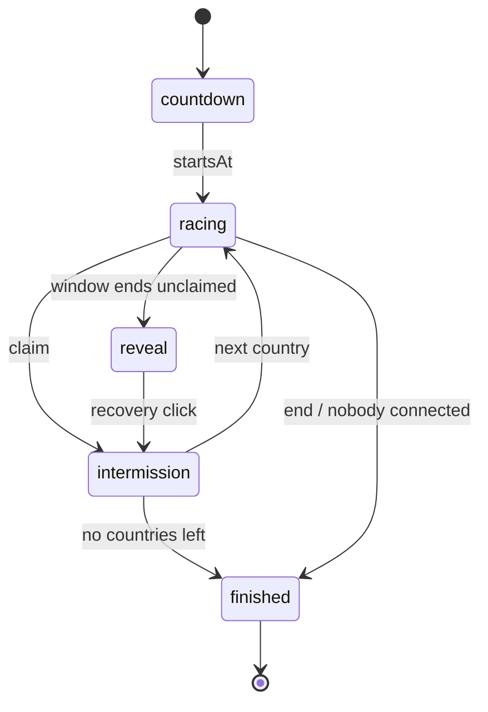

# Race Mode

The head-to-head game at `/race`: 2-4 players race through the same country sequence, and the first correct click claims each country.

## Why
Solo play has no opponent and no stakes.
A race needs rules every client and the server agree on to the point, so they live in one pure engine (`lib/engine/race.ts`) that runs unchanged in the browser and in the Durable Object.
Without that, scoring and claim order would drift between client and server and the mode would be cheatable.

## How it works

- **Setup:** the host picks a country set, a count (5-250), seats (2-4), a window (5, 10, 15 or 30s) and hints on/off.
  - Count defaults to 250 and the engine clamps it to the pool, so the default plays the whole set.
  - Draw and ranked sets (e.g. Daily 20) fix their own count.
- **Countdown:** 3s before the first country.
- **Claim:** first correct click on the live country claims it, then a 1.2s intermission.
- **Window:** each country is live for `countryWindowMs` (default 10s).
- **Reveal:** an unclaimed country waits with no deadline until someone clicks it.
  - That click is a *recovery*: a flat bonus, no claim, no streak.
  - Every streak breaks on a reveal.
- **Wrong clicks cost time, not tries:** a 1.5s lockout (`lockoutMs`).
  - Clicks while locked are ignored and do not extend it.
  - It is wall-clock, so it carries across a rollover.
  - Clicking an already-resolved country is free.
- **Leaving:** a disconnected player keeps their points but cannot claim; rejoining restores them.
  The race finishes early only when nobody is connected.
- **Host:** can kick in the lobby and end a running race (standings are whatever was played).
- **Rematch:** any player can reopen a finished room; seats, colours, host and settings carry over, readiness resets.

### Scoring (`RACE_SCORING`)

| Component | Points | When |
|---|---|---|
| Claim | 500 | Correct click inside the window |
| Speed | 0-250 | Scaled by the fraction of the window left |
| Accuracy | 100 | No wrong clicks on this country before the claim |
| Combo | 50 per consecutive claim beyond the first, max 250 | A claim ends everyone else's streak |
| Recovery | 100 | First click on a revealed country |

Standings: score desc, claims desc, total claim time asc, then id.
`isDraw` reports the top two equal on score, claims and claim time; the engine never declares a winner.

### Engine API

| Function | Role |
|---|---|
| `createRace(countryIds, config, seed, players, startsAt)` | Shuffle, slice to N, start the countdown. Players are fixed here. |
| `tick(state, now)` | Apply every due deadline with the real `now`. |
| `guess(state, playerId, countryId, now)` | Settle due deadlines, then claim, recover or lock out. |
| `leave` / `rejoin` | Connection flags; finishes the race when nobody is left. |
| `end(state, now)` | Finish now; unresolved countries stay out of `results`. |
| `publicView(state)` | What players receive. |
| `standings`, `isDraw` | Ranking and draw detection. |
| `nextTransitionAt`, `timeRemainingMs` | Clock helpers for the server alarm and the client timer bar. |

## Key files
- `lib/engine/race.ts` - race rules as pure transition functions
- `lib/engine/race.test.ts` - rule coverage
- `lib/engine/types.ts` - `RaceState`, `RaceView`, `RacePhase`
- `lib/constants.ts` - `RACE_CONFIG`, `RACE_SCORING`, `RACE_EVENT_LOG`, player colours

## Decisions and gotchas
- `phaseDeadline` is the only clock: `startsAt` in countdown, window end while racing, next country in intermission, null in reveal and finished.
- `tick` uses the real `now` per step, so an oversleeping server re-times from the present instead of cascading.
- `guess` settles deadlines first, but never claims a country that settling just revealed: nobody has seen it yet.
- `publicView` lists fields explicitly and omits `order` and `seed` until finished (either names every upcoming country), so a new state field is private until opted in.
- The state carries an event log of the last 20 claims, recoveries and expiries with score breakdowns, for the client feed.
- The engine never reads `RACE_CONFIG`; the lobby passes config in, so rooms can override it.

## Related
- [Game engine](game-engine.md)
- [Race server](race-server.md)
- [Race protocol](race-protocol.md)
- [Race client](race-client.md)
