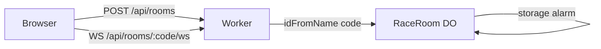

# Race Server

The authoritative backend for race mode: a Cloudflare Worker in `server/` with one `RaceRoom` Durable Object per room.

## Why
Clients only say "I clicked X"; the server owns the seed, the order, claim resolution and scoring.
That is the cheat resistance, and it gives every player one shared clock.
Without an authoritative room, two clients could both believe they claimed the same country.

## How it works

- **Routes** (`server/src/index.ts`):
  - `POST /api/rooms?set=<id>` mints a room code and calls `open()` on its object; origin-allowlisted, rate-limited to 20/min per IP.
  - `GET /api/rooms/:code/ws` forwards the socket upgrade to the room.
  - `GET /health`.
- **Rooms:** one Durable Object per room, addressed by `idFromName(code)`.
  That is the registry: no lookup table, no sticky routing.
  A socket to an unopened code gets `no_such_room`, so every live code was minted by the server and counted by the limiter.
- **Clock:** after every state change the room sets one storage alarm for the earlier of the race's `nextTransitionAt` and its own teardown, then hibernates with sockets open.
- **Teardown** (`ROOM_LIMITS`): a finished room is deleted 5 min after it ends; a room with nobody connected after 15 min.
- **Abuse limits:** frames over 2 KB are dropped; each socket has a token bucket (burst 30, refill 10/s) answered with `rate_limited`.
- **Lobby** (`server/src/lobby.ts`): seats, ready flags, colours, host role and settings as pure reducers with the engine's same-reference-means-no-op contract.
  - The host role passes to the next connected player when the host drops.
  - A kicked id is remembered and cannot rejoin.
  - Once the race starts, `lib/engine/race.ts` owns connection state.
- **Country pool** (`server/src/country-pool.ts`): continent sets partition the world, so the server needs no TopoJSON.
  Draw sets resolve through the shared `lib/geo/draws.ts`.

## Tech
- Cloudflare Workers, Durable Objects (SQLite-backed, hibernatable WebSockets, storage alarms), Workers rate limiting
- Wrangler for local dev (`pnpm race:dev`, port 8787) and deploy (`pnpm race:deploy`)
- Vitest for the pure modules in plain Node

## Key files
- `server/src/index.ts` - Worker entry, routes, CORS
- `server/src/race-room.ts` - `RaceRoom` Durable Object: sockets, persistence, alarms
- `server/src/lobby.ts` - pre-race lobby reducers
- `server/src/limits.ts` - `ROOM_LIMITS` (TTLs, frame size, token bucket)
- `server/src/country-pool.ts` - country ids and seeds per set
- `server/src/origin.ts` - `ALLOWED_ORIGINS` parsing and matching
- `server/src/protocol.ts` - frame codec
- `server/wrangler.jsonc` - DO binding, migrations, rate limiter, `ALLOWED_ORIGINS`
- `server/test/` - lobby and origin tests

## Decisions and gotchas
- **Why Durable Objects:** single-threaded execution serialises simultaneous claims, so the first processed wins, which is the tie-break the engine assumes.
  Alarms survive eviction, so there is no long-lived process, and hibernation makes an idle room free.
- Workers pin `Date.now()` between I/O; harmless because every engine call takes `now` as a parameter and the engine never polls.
- A Daily 20 race picks its countries with the day's seed but shuffles them with a fresh one, since today's solo order is public.
- The server bundles `lib/engine/*`, `lib/constants.ts`, `lib/geo/country-sets.ts`, `lib/geo/draws.ts`, `lib/race/room-code.ts` and `lib/race/types.ts` by relative import.
  Those modules must use relative imports (never `@/`) and stay free of browser and Next APIs.
- The DO wiring has no automated tests; it is exercised against `wrangler dev`.
- Vercel preview origins are not in `ALLOWED_ORIGINS`, so previews cannot create rooms.

## Related
- [Race mode](race-mode.md)
- [Race protocol](race-protocol.md)
- [Race client](race-client.md)
- [CI/CD](ci-cd.md)
